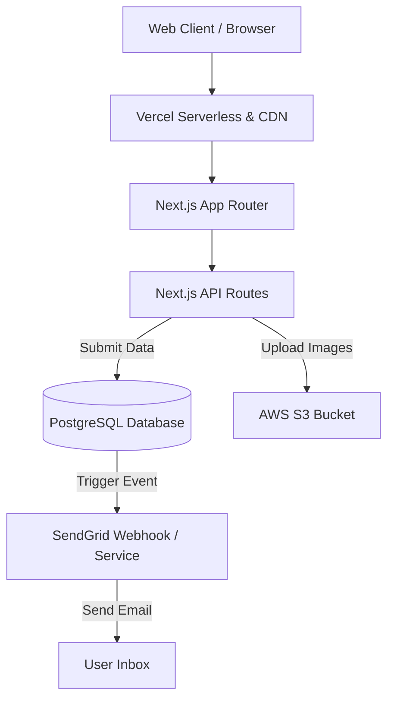

# DT's Vacation & Travel - Solution Architecture

## Overview
This document outlines the high-level architecture and infrastructural setup for the DT's Vacation & Travel platform, utilizing modern decoupled patterns.

## Frontend Layer
- **Hosting:** Vercel
- **Framework:** Next.js (App Router)
- **Styling:** Tailwind CSS v3 with a custom Brand Palette (60-30-10)
- **CDN:** Vercel Edge caching and Global CDN to ensure ultra-fast loading for high-res images and videos (critical for the "Immersive Hero Carousel" experience).

## Backend & Data Layer
- **Database:** PostgreSQL hosted on Supabase (or customized AWS RDS).
- **File Storage:** AWS S3 for secure handling of form-uploaded images (e.g., user photos in reviews, contact form attachments).
- **Email Delivery:** SendGrid for transactional automated emails (e.g., Welcome/Thank You emails upon contact inquiry).

## Architecture Diagram

## Security & Scaling Strategy
- All form endpoints and email triggers protected by rate limiting on Vercel Edge.
- S3 uploads utilize pre-signed URLs from the Next.js API to maintain optimal security boundaries.
- The use of Next.js Image component ensures automatic WebP optimization for heavy carousel assets.
