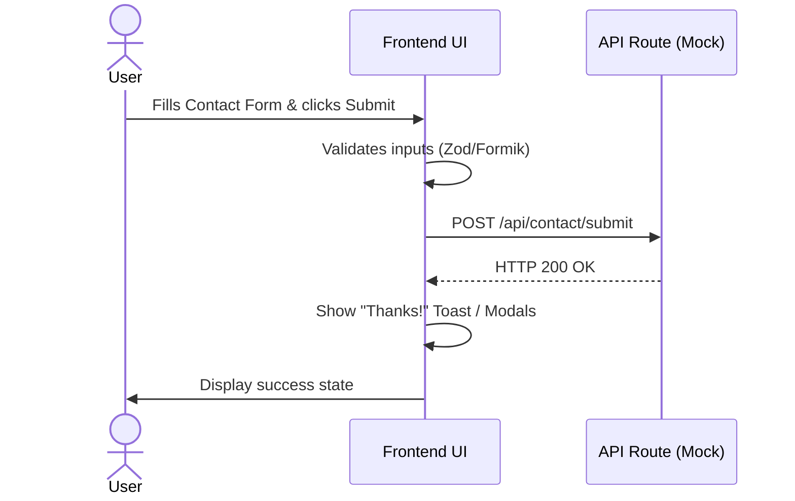

# Tech Spec: Sprint 1

## Sprint Scope
Focus limited to the foundational UI and logic for two main pages:
1. **Home Page:** Immersive Hero Carousel, Trust Bar, interactive components (Marquee, Service Cards, Quiz UI), and "Let's Chat" nav elements.
2. **Contact Page:** Form layout with mock submission and Custom Google Map (styled UI).

*Note: No live DB connections or SendGrid integrations in Sprint 1. We will use in-memory mock data and console validations.*

## API & Data Logic (Mocking Approach)
```typescript
// types
interface InquiryForm {
  name: string;
  email: string;
  interest: 'Wedding' | 'Retreat' | 'Adventure';
  message: string;
}

// Mock Submission API
POST /api/contact/submit
Input: InquiryForm
Output (Mock): { success: true, trackingId: string }
```

## Component Sequence: Contact Form Submission



## Business UI Logic
- **Hero Carousel:** 5s interval loop. When user manually clicks Next/Prev, clear interval and reset to prevent slide jumping.
- **Newsletter Pop-up:** Use `setTimeout` (15000ms) on `useEffect`. Attach a scroll listener to check if `window.scrollY / document.body.scrollHeight > 0.5`. Set a `hasOpened` boolean flag in Context/LocalState to prevent multiple triggers.
- **Targeted Nav (Home Hero):** 3 primary buttons act as anchor links down the page to the "Service Quiz" or specific "Service Cards" section.
